# RBM Agent: Reversible Free-Energy Minimization AI

[](LICENSE)

> Исследовательский PoC архитектуры искусственного сознания:  
> обратимые вычисления, перманентная память, энергетическая модель,  
> минимизация free energy. Совмещаем идеи Landauer/Bennett, Friston, Boltzmann, RevNet.

---

## 🚀 Концепция

Современные нейросетевые ИИ стирают детали опыта и тратят энергию на переписывание внутренних представлений.  
В этом проекте реализована гипотеза: **искусственное сознание** должно быть:

- **Обратимым по вычислениям** (Reversible Computing, Landauer/Bennett)
- **Перманентно накапливающим сигналы** (память не стирается)
- **Минимизирующим внутреннюю энергию** (Free-Energy Principle, Friston/Boltzmann)

Реализация:  
- RevNet (ResNet18 без fc, обратимая экстракция признаков)
- Restricted Boltzmann Machine (RBM, оценка free energy)
- Кольцевой буфер памяти (RingBuffer, хранит опыт без удаления)
- Минималистичная среда GridWorld для теста поведения агента

---

## 🧩 Архитектура

```plantuml
@startuml
actor "Окружение" as Env
rectangle "Сенсорный кодер\n(RevNet-18)" as SE
rectangle "Реверсивное ядро\n(RBM, Free-Energy)" as RI
database "Постоянная память\n(RingBuffer)" as PM
rectangle "Генератор действий\n(Policy/Critic)" as AG

Env -> SE : сенсорные стимулы
SE -> RI : признаки
RI -> PM : обновление памяти
PM -> RI : использование прошлого опыта
RI -> AG : принятие решений (policy)
AG -> Env : воздействие на среду
@enduml
````

* **Окружение (Env):** простая grid-world с шумом, reward = +1 за цель, -0.01 за шаг.
* **Сенсорный кодер (RevNet):** преобразует наблюдение в признаки.
* **Реверсивное ядро (RBM):** оценивает free energy, учится описывать состояния.
* **Постоянная память (RingBuffer):** хранит все состояния для обучения, ничего не забывается.
* **Генератор действий (Agent):** baseline — случайный, но поддержка ∇F/policy готова.

---

## 📦 Быстрый старт

1. **Клонируйте репозиторий и установите зависимости**

   ```bash
   git clone git@github.com:vsradkevich/rbm_agent.git
   cd rbm_agent
   python3 -m venv .venv && source .venv/bin/activate
   pip install -r requirements.txt
   ```

2. **Запустите обучение агента**

   ```bash
   python src/train.py
   ```

   * Агент будет учиться 30 эпох в среде GridWorld (по умолчанию 8x8).
   * Метрики (`rewards_log`, `free_energy_log`) выводятся в консоль и доступны для анализа.

---

## 📈 Пример вывода

```


Эпоха 1/30 | Суммарная награда: -0.640 | Ср. free energy: -22.0851
Эпоха 18/30 | Суммарная награда: 1.000 | Ср. free energy: -34.2501
...
```

* **Суммарная награда** показывает, как часто агент достигает цели.
* **Free energy** убывает — RBM учится "увереннее" описывать среду.

---

## 🧠 Документация по идее

**В чём отличие от классических RL/AI:**

* **Данные не стираются** — опыт хранится, память никогда не очищается (permanent memory).
* **Минимизация free energy** — не просто “наградная” оптимизация, а гармонизация с миром (минимизация неопределённости).
* **Обратимость** — возможно восстановить любой прошлый шаг (реверсивная логика, Landauer/Bennett).

**Интеграция идей:**

* **Landauer, Bennett:** реверсивные вычисления для минимизации тепловых потерь.
* **Friston FEP:** мозг минимизирует free energy, агент учится предсказывать мир с наименьшей неожиданностью.
* **RBM (Hinton):** энергетическая модель для оценки состояния.
* **RevNet/ResNet:** устойчивое извлечение признаков.

---

## 📁 Структура проекта

```
rbm_agent/
│
├── src/
│   ├── agent.py         # Агент: RevNet + RBM + Critic + policy
│   ├── buffer.py        # Кольцевой буфер памяти
│   ├── env.py           # Среда GridWorld
│   ├── inference.py     # (в разработке) Инференс/визуализация
│   ├── logger.py        # CSV-логгер метрик
│   ├── model/
│   │   ├── compressor.py  # (опционально) компрессия памяти
│   │   ├── critic.py      # Критик (градиент free energy)
│   │   ├── rbm.py         # Ограниченная машина Больцмана
│   │   └── revnet.py      # RevNet (ResNet18 без fc)
│   └── train.py         # Главный тренировочный цикл PoC
│
├── requirements.txt     # Зависимости
├── configs/             # (конфиги и пресеты)
└── logs/                # (метрики и результаты)
```

---

## 📚 Литература и источники

* Landauer, R. (1961). *Irreversibility and heat generation in the computing process*.
* Bennett, C.H. (1973). *Logical Reversibility of Computation*.
* Friston, K. (2010). *The free-energy principle: a unified brain theory?*
* Hinton, G. (2002). *Training products of experts by minimizing contrastive divergence*.

---

## 🛠 Roadmap (планы развития)

* [ ] Внедрить политику на основе ∇F (градиент free energy)
* [ ] Добавить визуализацию траекторий и анализа памяти
* [ ] Масштабировать RBM и тестировать на сложных средах (Atari, Procgen и др.)
* [ ] Интеграция мультимодальных данных (изображения, звук, текст)
* [ ] Статьи на Habr/Medium о результатах

---

## 🤝 Авторы и контакты

* Автор: [В.С. Радкевич](https://github.com/vsradkevich)
* Telegram: [@vsradkevich](https://t.me/vsradkevich)
* Обсуждение — через [Issues](https://github.com/vsradkevich/rbm_agent/issues), Pull Requests приветствуются!

---

## ⚖️ Лицензия

[MIT License](LICENSE) — свободное использование для науки, исследований и форков.

---

> Проект открыт к развитию!
> Присоединяйся, если интересуешься реверсивными вычислениями, искусственным сознанием и архитектурами следующего поколения.
